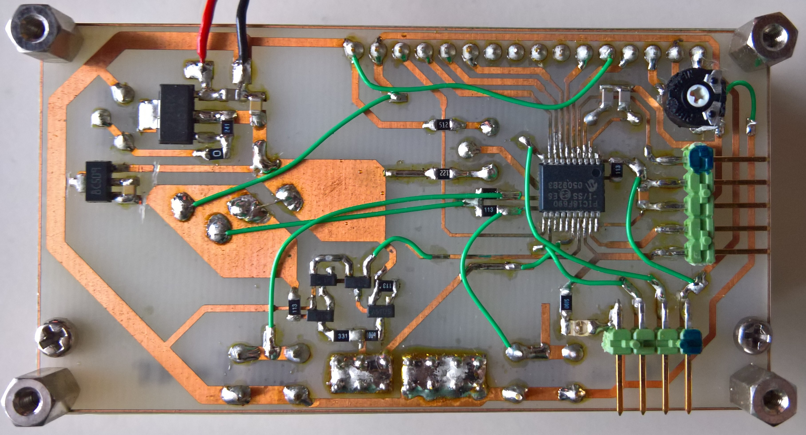

# Hardware

The PCB needs some air wires, look up in schematic. In the old version was a second voltage regulator, wich is no longer needed. These traces have to be cut.

### Etching

Print _C-Meter_pcb.pdf_ with the option "original size" on to a transparent film and use it as photomask.
